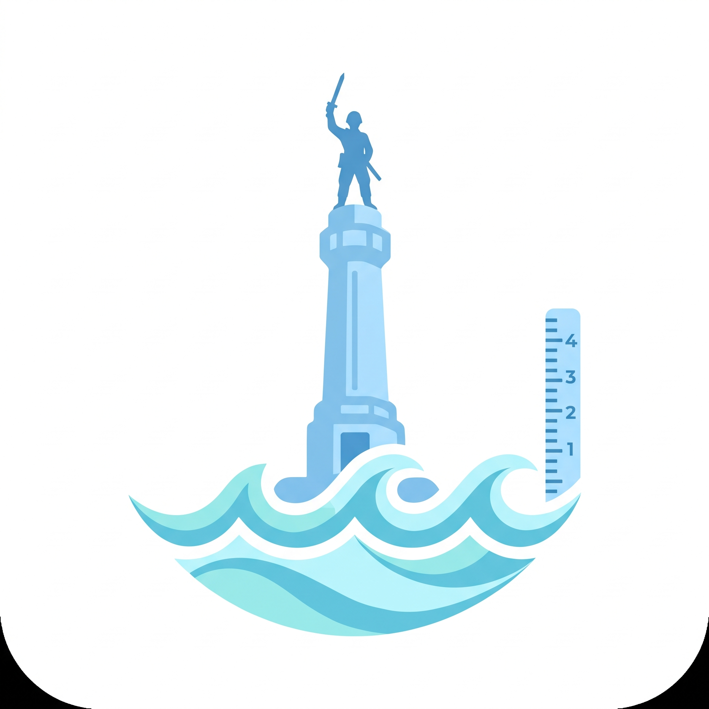

<div align="center">
  
  <h1>SIGMA AIR</h1>
  <p><strong>Sistem Informasi Genangan, Monitoring, dan Analisis Air</strong></p>
  <p>Platform monitoring rob dan banjir pesisir interaktif dengan integrasi API publik dan analisis risiko berbasis AI.</p>
</div>

---

## 🌊 Tentang SIGMA AIR

**SIGMA AIR** adalah platform peringatan dini untuk memantau ancaman banjir dan rob di wilayah pesisir Indonesia. Platform ini memadukan data cuaca lokal dari **BMKG**, prediksi pasang surut dari **WorldTides API**, serta laporan langsung (crowdsource) dari masyarakat. Semuanya dianalisis secara *real-time* oleh model AI mutakhir (**Llama 3.3 70B via Groq**) untuk menghasilkan peringatan risiko yang akurat dan mudah dipahami.

### ✨ Fitur Utama
- **🗺️ Peta Interaktif (Leaflet.js):** Pemantauan kondisi wilayah secara visual dengan indikator cuaca, tinggi gelombang, dan titik genangan.
- **🤖 Analisis Risiko AI:** Ringkasan ancaman *real-time* yang dihasilkan oleh AI Llama 3.3 70B yang menganalisis seluruh variabel lingkungan.
- **📡 Multi-Sumber Data:** Menggabungkan data dari Open-Meteo, WorldTides, dan BMKG dalam satu *dashboard*.
- **📱 Laporan Warga (Crowdsource):** Formulir cepat untuk warga melaporkan kondisi genangan (didukung unggahan media max 10MB) yang langsung tersinkronisasi antar pengguna.
- **⚡ Real-Time Sync:** Menggunakan Supabase untuk menyebarkan laporan warga secara instan (WebSocket).
- **🌙 Dark Mode & Responsive UI:** Desain antarmuka premium yang memanjakan mata dan bekerja mulus di perangkat *mobile* (PWA-ready).

---

## 🛠️ Tech Stack

- **Framework:** [Next.js 16](https://nextjs.org/) (App Router) + Turbopack
- **Styling:** [Tailwind CSS v3](https://tailwindcss.com/)
- **Database & Realtime:** [Supabase](https://supabase.com/) (PostgreSQL + Storage)
- **Maps:** [Leaflet.js](https://leafletjs.com/) & React-Leaflet
- **AI Engine:** [Groq API](https://groq.com/) (Llama 3.3 70B Versatile)
- **Weather & Tides API:** Open-Meteo, WorldTides

---

## 🚀 Panduan Instalasi Lokal

### 1. Kloning Repositori
```bash
git clone https://github.com/KangBasrengg/SIGMA-AIR.git
cd SIGMA-AIR
```

### 2. Instalasi Dependensi
```bash
npm install
```

### 3. Konfigurasi Environment Variables
Buat file `.env.local` di root folder dan masukkan kunci API Anda:
```env
# Integrasi Pasang Surut & Cuaca
WORLDTIDES_API_KEY=your_worldtides_api_key

# Integrasi AI Analytics
GROQ_API_KEY=your_groq_api_key

# Integrasi Supabase (Database Laporan Warga)
NEXT_PUBLIC_SUPABASE_URL=your_supabase_url
NEXT_PUBLIC_SUPABASE_ANON_KEY=your_supabase_anon_key
```

### 4. Setup Supabase (Database)
Jalankan *query* SQL berikut di menu **SQL Editor** Supabase Anda:
```sql
CREATE TABLE citizen_reports (
  id UUID DEFAULT gen_random_uuid() PRIMARY KEY,
  region_id TEXT NOT NULL,
  description TEXT NOT NULL,
  media_url TEXT,
  confidence INTEGER DEFAULT 75,
  created_at TIMESTAMP WITH TIME ZONE DEFAULT NOW()
);

ALTER PUBLICATION supabase_realtime ADD TABLE citizen_reports;

-- Buat storage bucket 'media' dan set agar public
INSERT INTO storage.buckets (id, name, public) VALUES ('media', 'media', true);

CREATE POLICY "Media public read access" ON storage.objects FOR SELECT USING ( bucket_id = 'media' );
CREATE POLICY "Media public upload access" ON storage.objects FOR INSERT WITH CHECK ( bucket_id = 'media' );
```

### 5. Jalankan Server Development
```bash
npm run dev
```
Buka [http://localhost:3000](http://localhost:3000) di browser Anda untuk melihat hasilnya.

---

## 📝 Lisensi
Proyek ini bersifat *Open Source* dan dirancang untuk keperluan mitigasi bencana di Indonesia.
